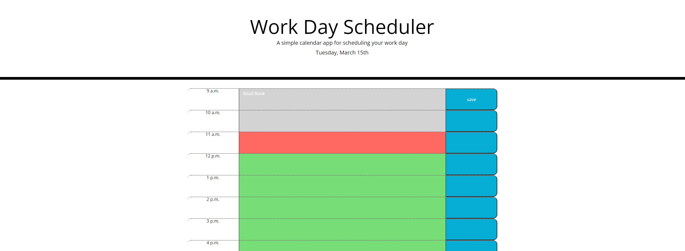

# Work Day Scheduler

## Description

This project is an online web application designed to resemble one's daily business planner. With this application, the user can store tasks based on the hourly timeblocks throughout the business day(9am-5pm). This project uses Bootstrap and JQuery in order to complete the layout, as well as save tasks to each block and change the time-blocks colors based on the current time.

### Screenshot:

**Link to Deployed Application:**
https://mberti13.github.io/password-generator/
